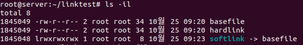
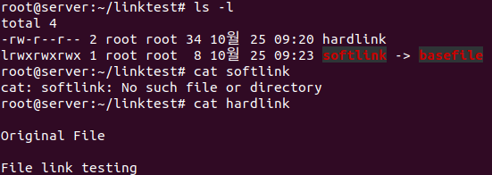
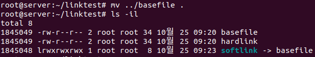

# Ubuntu Linux

## Testing stance

### VMware
- Player

- Pro (30일 제한, 이후 부가 기능만 사용 가능)
    - (스냅샷 기능, ens 설정)
### 1. Server (Ubuntu 20.04 DeskTop)
- [우분투 데스크탑 다운로드] (http://old-releases.ubuntu.com/releases/20.04.0/ubuntu-20.04-desktop-amd64.iso)
### 2. Server(B) (Ubuntu 20.04 Server)
- [우분투 서버 다운로드] (http://old-releases.ubuntu.com/releases/20.04.0/ubuntu-20.04-live-server-amd64.iso)
### 3. Client (Kubuntu 20.04)
- [쿠분투 다운로드 링크] (http://cdimage.ubuntu.com/kubuntu/releases/20.04/release/kubuntu-20.04.6-desktop-amd64.iso)
### 4. WinClient (Win 10 평가판)
- [평가판 다운로드 링크(한국어 32bit)] (https://www.microsoft.com/ko-kr/evalcenter/download-windows-10-enterprise)

## 네트워크 설정
Ubuntu
- VMWare의 IP를 수동으로 바꿔준 후, 게이트웨이 연결 (윈도우 Command 창에서)
    - `ipconfig`
- VMWare Network Adaptor VMnet8을 확인
    - `VMWare Pro`에서 설정을 바꿔야 함.
    - [Edit] > [Virtual Network Editor]
    - Change Setting
    - Subnet IP : 192.168.111.0 (사설 네트워크에서 자주 쓰임)
- Ubuntu에서 IP 주소 확인
    - `ip addr`  

## 패키지 설치 dpkg, apt
- 우분투 : 리눅스 데비안 계열
    - 확장자가 deb(debian package) 설치파일

```
dpkg -l [패키지 이름] : 설치된 패키지 확인 가능
dpkg --info [파일명.deb] : 파일정보 확인 가능
dpkg -L zip : 모든 패키지 파일 확인 가능
dpkg -i [파일명.deb] : 패키지 설치
dpkg -r [패키지 이름] : 패키지 삭제

단점 : 패키지 파일이 있어야 하고, 의존성 문제가 있을 시 설치되지 않음.

axel 패키지 : 파일 다운로드 패키지
galculator 패키지 : GTK 환경에서 사용되는 기초 과학 모드 계산기

apt : 인터넷을 통해 다운로드와 의존성 문제를 해결해주는 패키지 관리자
apt install [패키지 명] : 패키지 설치
apt update : apt 목록 업데이트
apt remove [패키지 명] : 패키지 삭제
apt purge [패키지 명] : 패키지 삭제 + 설정파일 까지 제거
apt autoremove : 자주 사용하지 않는 패키지 자동 제거
apt-cache show [패키지 명] : 설치하지 않은 패키지 확인
apt-cache depends [패키지 명] : 의존성 파일 확인
apt-cache rdepends [패키지 명] : 이 패키지를 의존하는 패키지 확인
```

### apt 작동 방식
/etc/apt/sources.list 파일 내부의 패키지 목록을 불러옴.  
- 저장소 종류
    - main : 공식 무료
    - universe : 비공식 무료
    - multiverse : 비공식 유료
    - restricted : 공식 유료
- 버전 코드
    - focal : 20.04 버전 지칭 (각 버전별 코드 있음)
    - focal-updates : 최신 버전의 패키지 설치
- 저장소 URL
    - ubuntu package mirror 사이트에서 URL을 가져옴.
- apt 동기화
    - $ apt update : sources.list 파일을 업데이트 함.
    - $ apt upgrade : 라이브러리에 있는 패키지 최신버전으로 업그레이드

## 압축 파일과 묶기
### 압축
- gz, xz, bz2(bzip2), zip 등을 사용
- xz
    - xz [파일명] : 파일 압축 (기존 파일 삭제)
    - xz -d [파일명.xz] : 압축 해제 (압축파일 삭제)
    - xz -k [파일명] : 파일 압축 (기존 파일 유지)
- bzip2
    - bzip2 [파일명] : 파일 압축 (기존 파일 삭제)
    - bzip2 -d [파일명.bz2] : 압축 해제 (압축파일 삭제)
    - bzip2 -k [파일명] : 파일 압축 (기존 파일 유지)
- gzip
    - gzip [파일명] : 파일 압축 (기존 파일 삭제)
    - gzip -d [파일명.gz] : 압축 해제 (압축파일 삭제)
    - gzip -k [파일명] : 파일 압축 (기존 파일 유지)
- zip
    - zip [생성될파일명.zip] [파일명] : 파일 압축 (기존 파일 유지)
    - unzip [파일명.zip] : 압축 해제 (압축파일 유지)
### 묶기
- tar : 파일 묶기 (리눅스에선 원칙적으로 '파일 묶기'와 '파일 압축'이 별개로 실행)  
    <strong>[동작]</strong>
    - c : 새로운 묶음
    - x : 묶음 해제  

    <strong>[옵션]</strong>
    - C : 새롭게 만들어준 폴더(지정한 디렉터리)에 압축묶음 풀기
    - f : 파일로 묶음 (default는 테이프)
    - v : 묶거나 푸는 과정을 보여줌
    - j : bzip2
    - J : xz
    - z : gzip


## 명령어  

### 링크  
- 하드링크 : inode를 직접가리켜서 원본 파일이랑 동일한 inode를 갖게 됨.  
ln [옵션x] [원본파일] [새로생성할 파일 이름]  
원본파일과 같이 허가권, 소유권, 파일크기 같음.
- 심볼릭 링크 : 윈도우에서 바로가기 같은 것  
ln -s [원본파일] [새로생성할 파일 이름]  
파일크기가 경로명만큼 작음.


원본파일을 부모폴더로 옮기기


다시 원본파일을 기존 폴더로 옮기기  


### vi 에디터  
```
yy : 라인 복사
[숫자]yy : 원하는 라인 숫자 복사
p(소문자) : 아래에 붙여넣기
P(대문자) : 위에 붙여넣기
```

### 파일 위치 검색
- find
    - 옵션
        - -name (파일명 검색)
        - -user (소유자)
        - -perm (허가권)
        - -size (파일크기) +(이상), -(이하)
- which [패키지 명] : 경로에 설정된 디렉토리 검색
- whereis [패키지 명] : 실행파일, 메뉴얼 위치

### cron
- 주기적으로 반복되는 일을 자동으로 실행할 수 있도록 시스템 작업 예약
- /etc/crontab
- \* * * * * root(사용자이름) /root/myBackup.sh(스크립트)
    - 분 / 시 / 일 / 월 / 요일 / 사용자 / 실행명령
    - cf) \* * * * * run-parts 폴더 : 폴더내에 있는 파일 모두 실행
- shell Script 사용시 실행 퍼미션(허가권)을 줘야한다.
    - chmod 755 (파일명)
- crontab 파일 수정 후
    - systemctl restart cron (크론 데몬을 재시작)
- 시간 관련 명령어
    * timedatectl set-ntp 0 (시간을 수동으로 변경할 수 있게 해줌)
    * date 011503002030 (1월 15일 3시 2030년으로 시간 변경해줘)
    * rdate time.bora.net (타임서버에서 정확한 시간으로 변경)
        - apt install rdate

- at : 일회성 예약 명령어 : 한번 실행 후 소멸
```shell
at [시간]
$ at 3:00am tomorrow : 내일 새벽 3시
$ at 11:00pm January 30 : 1월 30일 오후 11시
$ at now +1 hours : 지금으로부터 한 시간 후

- 스크립트 명령어 입력하고 종료할 때 ctrl + d
$ at -l : 예약 확인 리스트 (작업번호 확인 가능)
$ atrm [작업번호] : 예약 취소
```  
