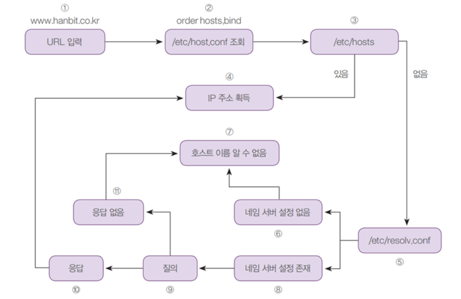
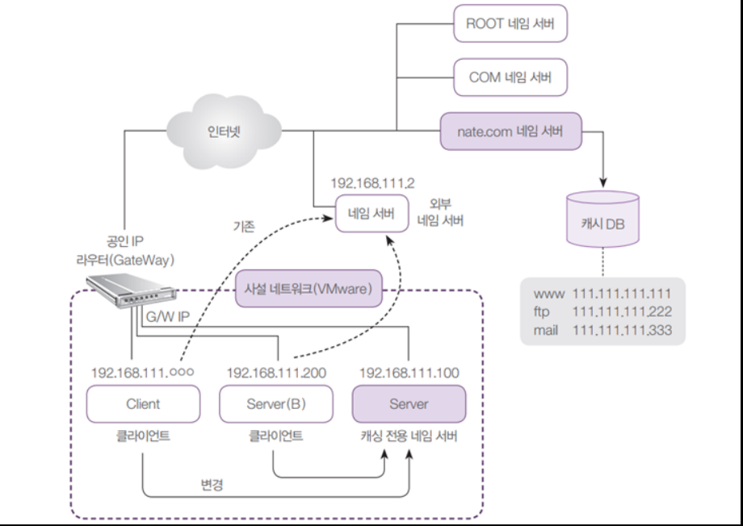

# Ubuntu Linux

## Testing stance

### VMware
- Player

- Pro (30일 제한, 이후 부가 기능만 사용 가능)
    - (스냅샷 기능, ens 설정)
### 1. Server (Ubuntu 20.04 DeskTop)
- [우분투 데스크탑 다운로드] (http://old-releases.ubuntu.com/releases/20.04.0/ubuntu-20.04-desktop-amd64.iso)
### 2. Server(B) (Ubuntu 20.04 Server)
- [우분투 서버 다운로드] (http://old-releases.ubuntu.com/releases/20.04.0/ubuntu-20.04-live-server-amd64.iso)
### 3. Client (Kubuntu 20.04)
- [쿠분투 다운로드 링크] (http://cdimage.ubuntu.com/kubuntu/releases/20.04/release/kubuntu-20.04.6-desktop-amd64.iso)
### 4. WinClient (Win 10 평가판)
- [평가판 다운로드 링크(한국어 32bit)] (https://www.microsoft.com/ko-kr/evalcenter/download-windows-10-enterprise)

## 네트워크 설정
Ubuntu
- VMWare의 IP를 수동으로 바꿔준 후, 게이트웨이 연결 (윈도우 Command 창에서)
    - `ipconfig`
- VMWare Network Adaptor VMnet8을 확인
    - `VMWare Pro`에서 설정을 바꿔야 함.
    - [Edit] > [Virtual Network Editor]
    - Change Setting
    - Subnet IP : 192.168.111.0 (사설 네트워크에서 자주 쓰임)
- Ubuntu에서 IP 주소 확인
    - `ip addr`  

## 패키지 설치 dpkg, apt
- 우분투 : 리눅스 데비안 계열
    - 확장자가 deb(debian package) 설치파일

```
dpkg -l [패키지 이름] : 설치된 패키지 확인 가능
dpkg --info [파일명.deb] : 파일정보 확인 가능
dpkg -L zip : 모든 패키지 파일 확인 가능
dpkg -i [파일명.deb] : 패키지 설치
dpkg -r [패키지 이름] : 패키지 삭제

단점 : 패키지 파일이 있어야 하고, 의존성 문제가 있을 시 설치되지 않음.

axel 패키지 : 파일 다운로드 패키지
galculator 패키지 : GTK 환경에서 사용되는 기초 과학 모드 계산기

apt : 인터넷을 통해 다운로드와 의존성 문제를 해결해주는 패키지 관리자
apt install [패키지 명] : 패키지 설치
apt update : apt 목록 업데이트
apt remove [패키지 명] : 패키지 삭제
apt purge [패키지 명] : 패키지 삭제 + 설정파일 까지 제거
apt autoremove : 자주 사용하지 않는 패키지 자동 제거
apt-cache show [패키지 명] : 설치하지 않은 패키지 확인
apt-cache depends [패키지 명] : 의존성 파일 확인
apt-cache rdepends [패키지 명] : 이 패키지를 의존하는 패키지 확인
```

### apt 작동 방식
/etc/apt/sources.list 파일 내부의 패키지 목록을 불러옴.  
- 저장소 종류
    - main : 공식 무료
    - universe : 비공식 무료
    - multiverse : 비공식 유료
    - restricted : 공식 유료
- 버전 코드
    - focal : 20.04 버전 지칭 (각 버전별 코드 있음)
    - focal-updates : 최신 버전의 패키지 설치
- 저장소 URL
    - ubuntu package mirror 사이트에서 URL을 가져옴.
- apt 동기화
    - $ apt update : sources.list 파일을 업데이트 함.
    - $ apt upgrade : 라이브러리에 있는 패키지 최신버전으로 업그레이드

## 압축 파일과 묶기
### 압축
- gz, xz, bz2(bzip2), zip 등을 사용
- xz
    - xz [파일명] : 파일 압축 (기존 파일 삭제)
    - xz -d [파일명.xz] : 압축 해제 (압축파일 삭제)
    - xz -k [파일명] : 파일 압축 (기존 파일 유지)
<image src="./ImageFolder/xz.png">
- bzip2
    - bzip2 [파일명] : 파일 압축 (기존 파일 삭제)
    - bzip2 -d [파일명.bz2] : 압축 해제 (압축파일 삭제)
    - bzip2 -k [파일명] : 파일 압축 (기존 파일 유지)
<image src="./ImageFolder/bzip2.png">
- gzip
    - gzip [파일명] : 파일 압축 (기존 파일 삭제)
    - gzip -d [파일명.gz] : 압축 해제 (압축파일 삭제)
    - gzip -k [파일명] : 파일 압축 (기존 파일 유지)
<image src="./ImageFolder/gzip.png">
- zip
    - zip [생성될파일명.zip] [파일명] : 파일 압축 (기존 파일 유지)
    - unzip [파일명.zip] : 압축 해제 (압축파일 유지)
<image src="./ImageFolder/zip.png">
### 묶기
- tar : 파일 묶기 (리눅스에선 원칙적으로 '파일 묶기'와 '파일 압축'이 별개로 실행)  
    <strong>[동작]</strong>
    - c : 새로운 묶음
    - x : 묶음 해제  

    <strong>[옵션]</strong>
    - C : 새롭게 만들어준 폴더(지정한 디렉터리)에 압축묶음 풀기
    - f : 파일로 묶음 (default는 테이프)
    - v : 묶거나 푸는 과정을 보여줌
    - j : bzip2
    - J : xz
    - z : gzip

## 모듈과 커널
`커널 : 컴퓨터 운영 체제의 핵심이 되는 컴퓨터 프로그램으로 부팅시에 메모리에 로딩하는 코드`  
커널 위에 우분투나, CentOS나 RHCSA를 탑재  

`모듈 : 항상 사용되는 것이 아닌 가끔 사용되는 필수적인 라이브러리를 별도로 보관하는 것`  

- 커널 컴파일
    - 리눅스 배포판을 다운로드 받아 최신 버전 업그레이드 (최신 배포판의 경우 업그레이드를 통해 커널 업데이트가 원활히 이루어짐)
    - 다운로드 순서
        - 커널 소스 다운로드 : `kernel.org 사이트에서` tar형태로
        - 커널 소스 압축 풀기
        - `$ make mrproper` : 커널 설정 초기화
        - `$ make xconfig` : 커널 환경 설정 (Cpu, NTFS 설정 등)
        - make clean : 이전 컴파일 정보 삭제
        - 커널 컴파일 설치
            - `$ make`
            - `$ make module_install`
            - `$ make install`
- `$ unmame -r` : 현재 커널 버전 확인

## 하드디스크 추가하기

### 장치 타입
- IDE
- SCSI : 서버 및 기업용으로 주로 사용
    - SCSI 0:0~15(7번 제외) => 15개 * 슬롯 4개 : 총 60개
    - SCSI 하드디스크 장착시
        - 물리적 장치 ex) `/dev/sda`, `/dev/sdb` ...
        - 논리적 장치 ex) `/dev/sda1`, `/dev/sda2` ...
- SATA : PC용으로 주로 사용 
    - SATA 0:0~29 => 30개 * 슬롯 4개 : 120개
- NVMe

- 리눅스에서 하드디스크 추가 순서
    1. 물리적 디스크 장착 (/dev/sdb)
        - fdisk [물리적장치위치]
            - n (파티션 분할)
                - primary > 파티션 번호(1~4) > 시작섹터(enter) > 마지막섹터(enter) > p(설정 확인) > w
    2. 파티션 설정 (/dev/sdb1)
        - mkfs.ext4 [논리적장치위치]
    3. 파일 시스템 생성 (포맷)
        - mkdir [마운팅될디렉토리명]
        - mount [논리적장치위치] [마운팅될디렉토리명]
    4. /etc/fstab에 등록
        - 재부팅 후에도 마운팅 상태
        -    `(filesystem) (mount point) (type)  (option)    (dump)  (pass)`
        - ex) `/dev/sdb1 <>  /mydata  <>   ext4  <>  defaults <>    0   <>    0`

## RAID 방식 (Redundant Array of Inexpensive(Independent) Disks)
`서버 컴퓨터 저장장치는 대부분 RAID를 사용한다.`
- 하드웨어 RAID : 제조업체에서 하드디스크를 연결한 장비를 설치
    - 안정적이지만 / 고가
- 소프트웨어 RAID : 운영체제(OS)에서 지원하는 방식
    - 하드웨어 RAID 보다 덜 안정적이지만 저렴한 비용으로 안전하게 데이터 저장

- RAID Level
> 단순 볼륨

> Linear RAID : 2개 이상의 하드디스크를 연결만

> RAID 0 : Stripping 
>> - 여러 개의 디스크를 병렬로 배치하여 사용  
>> - 100%의 공간효율성, 빠른 속도  
>> - 결함 허용 안됨 : 데이터의 위험성이 증가, 하나가 고장나면 데이터 손상
>> - 빠른 성능이 필요하지만, 잃어버려도 문제가 없는 데이터

> RAID 1 : Mirroring
>> - 여러 개의 디스크에 데이터를 중복하여 기록  
>> - 하드 디스크의 용량을 절반만 사용 가능  
>> - 결함 허용 : 하나가 고장이 나더라도 데이터 손상 없음.  
>> - 데이터 저장에 2배의 용량이 필요, 50% 공간효율성  
>> - 중요한 데이터를 저장하기에 적합

> RAID 2, 3, 4는 실제 사용하지 않음.

> RAID 5 
>> - 패리티 비트를 사용해 데이터를 복구 (각 멤버 디스크에 순환 저장)
>> - 한 디스크가 고장나도 패리티 비트를 통해 저장상태를 유추 + 데이터 사용 가능
>> - 최소 3개 이상의 디스크가 필요
>> - 공간 효율성은 (N-1) 

### mdadm으로 Raid 구축 순서
1. 선처리 작업 (파티션 만들기)
    - fdisk를 통해 파티션 만들고
    - type을 Linux raid auto로 준다.
2. 볼륨 그룹 생성
    ```
    $ mdadm --create [생성할 논리 볼륨 (/dev/md9)] --level=[raid 타입 (linear)] --raid-device=[장치 연결 갯수] [논리 디스크 (/dev/sdb1)] [논리 디스크 (/dev/sdc1)] 
    ->
    $ mdadm --create /dev/md9 --level=linear --raid-device=2 /dev/sdb1 /dev/sdc1
    ```
3. 파일 시스템 포맷  
    `mkfs.ext4 [논리볼륨]`
4. 마운트
    - 연결할 디렉토리 생성
        - `mkdir /raidLinear` > 폴더 생성
        - `mount /dev/md9 /raidLinear` > 디바이스 마운트
5. /etc/fstab에 등록
    - [장치명] [마운트위치] [타입] [옵션] [dump] [pass]
    - /dev/md9 /raidLinear ext4 defaults 0 0
6. /etc/mdadm/mdadm.conf에 등록
    - mdadm --detail --brief /dev/md0 >> /etc/mdadm/mdadm.conf
    - mdadm --detail --brief /dev/md1 >> /etc/mdadm/mdadm.conf
    - mdadm --detail --brief /dev/md9 >> /etc/mdadm/mdadm.conf
    - mdadm --detail --brief /dev/md5 >> /etc/mdadm/mdadm.conf
    - update-initramfs -u 명령어로 커널 업그레이드
    - reboot or init 6
```
- 확인용 보조 명령
    - ls -l /dev/md* : 논리 볼륨 확인
    - mdadm --detail /dev/md9 : [논리볼륨] 레이드 자세히
    - df : 마운트 된 디스크 공간 확인
    - mdadm --detail --scan : Raid 확인

- 기타 명령
    - mdadm --stop /dev/md9 : [논리볼륨] 장치 중지
    - mdadm --run /dev/md9 : [논리볼륨] 장치 가동(중지가 되어 있을 때)

- 하드디스크 고장 확인 작업
    1. cp 명령 사용하여 아무 파일 복사
        - /raid0, /raid1, /raid5 /raidLinear
    2. 예시와 같이 하드디스크 제거 후 부팅
        - ls -l /dev/sd*
        - df 명령으로 확인
        - mdadm --detail --scan
    3. 결함 허용 되는 RAID 재가동
        - mdadm --run /dev/md1
        - mdadm --run /dev/md5
    4. 마운트
        - mount /dev/md1 /raid1
        - mount /dev/md5 /raid5
    5. 파일 확인
        - ls /raid1
        - ls /raid5
    6. 장치 상태 확인
        - mdadm --detail /dev/md1
        - mdadm --detail /dev/md5
```

## HardWare

### LVM (Logical Volume Manager)

`여러가지 하드 디스크를 합쳐 한 개의 파티션으로 구성한 뒤 필요에 따라 파티션을 다시 나누는 것`  

- 물리 볼륨 (Physical Volume) : ex. /dev/sda1, /dev/sda2 ...
- 볼륨 그룹 (Volume Group) : 물리 볼륨을 합쳐서 그룹으로 만든 것 ex. /dev/volumeGroup
- 논리 볼륨 (Logical Volume) : 볼륨 그룹을 나눈 것 ex. /dev/volumeGroup/lvm1, /dev/volumeGroup/lvm2 ...

### Quota (쿼터)
`파일 시스템 마다 사용자나 그룹이 생성할 수 있는 파일과 용량 개수 제한`
- 패키지 : quota
    - `$ apt -y install quota`

### Shell Scripting Programming
- Shell : 사용자가 입력한 명령을 해석해 커널로 전달하거나 커널의 처리 결과를 사용자에게 전달하는 것
    - default shell : bash shell
- 환경변수
    - $ echo `$PATHNAME`
    - 시스템 전체에 사용되는 변수, 셸 스크립트에서 자주 활용
    - 일반적으로 대문자로 작성
    - 환경변수 목록 확인 `env`, `printenv`
    - 선언 : 
        - ex. `$ name="JIM"` ('=' 얖 옆에 공백이 있으면 안됨) (대소문자 구분)
        - ex. `$ age=25` (숫자를 넣어도 문자열로 인식)
        - ex. `$ name="JIM CARRY"` (문자열에 공백이 있을시, ""로 묶어야 함)
- 셸 스크립트 실행
    - sh [파일위치/파일명]
    - 실행 옵션 추가 (chmod +x [파일위치/파일명]) -> ./[파일위치/파일명]
    ``` shell
    #! /bin/sh
    myvar="Hi Ubuntu"
    echo $myvar # Hi Ubuntu 문자열 출력
    echo "$myvar" # Hi Ubuntu 문자열 출력
    echo '$myvar' # $myvar 문자열 출력
    echo /$myvar # $myvar 문자열 출력
    exit 0
    ```

    ``` shell
    #!/bin/sh
    echo "Enter your name : "
    read user_name # user_name이라는 변수에 사용자 입력받기
    echo "Hello $user_name!"
    exit 0
    ```

    ``` shell
    #!/bin/sh
    num1=100
    num2=$num1+200 # 문자열로 취급되어서 계산
    echo $num2 # 100+200 문자열 출력
    num3=`expr $num1 + 200` # 띄어쓰기 필수
    echo $num3 # 300 출력
    echo $((num1 + num3)) # 400 출력 괄호 두개도 산술식 연산 가능
    num4=`expr \($num1 + 200\) / 10 \* 2` # 소괄호와 *앞에는 escape문자 사용
    echo $num4
    exit 0
    ```

    ``` shell
    #!/bin/sh
    echo "실행 명령어는 <$0> 이다"
    echo "첫번째 파라미터 : $1"
    echo "두번째 파라미터 : $2"
    echo "전체 파라미터 : $*"
    echo "파라미터 개수 : $#"
    exit 0
        ```
        실행 : $ parameter.sh abc def ghi jk
        결과 : 실행 명령어는 <parameter.sh> 이다.
               첫번째 파라미터 : abc
               두번째 파라미터 : def
               전체 파라미터 : abc def ghi jk
               파라미터 개수 : 4
        ```
    ```

    ``` shell
    #!/bin/sh
    if [ "ubuntu" = "ubuntu" ] # 조건 사이 각 단어에는 공백이 있어야 함 '='이나 '==' 둘다 사용 가능
    then
        echo "참입니다."
    else
        echo "거짓입니다."
    fi
    exit 0
        ```
        -n "문자열" : 빈 문자열(null)이 아니면 참
        -z "문자열" : 빈 문자열(null)이면 참
        수식1 -eq 수식2 : 두 수식이 같으면 참 (equal)
        수식1 -ne 수식2 : 두 수식이 다르면 참 (not equal)
        수식1 -gt 수식2 : 수식1이 수식2보다 크면 참 (greater than)
        수식1 -ge 수식2 : 수식1이 수식2보다 크거나 같으면 참 (greater than equal)
        수식1 -lt 수식2 : 수식1이 수식2보다 작으면 참 (less than)
        수식1 -le 수식2 : 수식1이 수식2보다 작거나 같으면 참 (less than equal)
        ```
    ```

    ``` shell
    #!/bin/sh
    num1=10 # gt, ge, lt, le, eq, ne 다 사용해보기 위해 수정하면서 풀이하면 됨
    num2=10
    if [ $num1 -eq $num2 ]; then
        echo "두 수식이 같습니다."
    else
        echo "두 수식이 다릅니다."
    fi
    ```

    ``` shell
    #!/bin/sh
    fname=/lib/systemd/system/cron.service
    if [ -f $fname ]; then
        head -5 $fname # 파일의 5줄만 실행
    else
        echo "cron 서비스가 설치되어있지 않습니다."
    fi

    fname=/root
    if [ -d $fname ]; then
        echo "디렉토리입니다."
    else
        echo "디렉토리가 아닙니다."
    fi
    exit 0

    fname=/root/name.sh
    if [ -x $fname ]; then
        echo "실행가능한 파일입니다."
    else
        echo "실행가능한 파일이 아닙니다."
    fi
    exit 0
        ```
        [ -d 파일명 ] : 파일이 디렉토리면 참
        [ -e 파일명 ] : 파일이 존재하면 참
        [ -f 파일명 ] : 파일이 일반파일이면 참
        [ -x 파일명 ] : 파일이 실행가능이면 참
        [ -r 파일명 ] : 파일이 읽기가능이면 참
        [ -w 파일명 ] : 파일이 쓰기가능이면 참
        [ -s 파일명 ] : 파일이 비어있지 않으면 참
        ```
    ```

    ``` shell
    #!/bin/sh
    case "$1" in
        start)
            echo "시작";;
        stop)
            echo "중지";;
        restart)
            echo "재시작";;
        *)
            echo "잘못된 명령";;
    esac

    echo "리눅스가 재미있나요? (yes / no)"
    read answer
    case $answer in
        yes | y | Y | YES | Yes )
            echo "Good";;
        [nN]* ) # n으로 시작하거나, N으로 시작하는 모든 패턴
            echo "Bad..";;
        *)
            echo "Answer again (yes/no)"
            exit 1;; # 에러 발생시 종료
    esac
    exit 0
        ```
        case 변수 in
            패턴1)
                # 실행 코드
                ;;
            패턴2)
                # 실행 코드
                ;;
            *)
                # 모든 패턴 일치하지 않을 때 실행 코드
                ;;
        esac # case 반대로 뒤집은 것
        ```
    ```

    ``` shell
    #!/bin/sh
    echo "읽고 싶은 파일을 입력하세요"
    read fname
    if [ -f $fname ] && [ -s $fname ]; then
        head -5 $fname
    else
        echo "파일이 없거나, 크기가 0 입니다."
    fi
    exit0
    ```

    ``` shell
    #!/bin/sh
    sum=0
    for i in 1 2 3 4 5 6 7 8 9 10
    do
        sum=`expr $sum + $i`
    done
    echo "1부터 10까지 합 : $sum"

        ``` bash shell
            #/bin/bash
            fruits=("apple" "orange" "banana" "grape")
            for fruit in ${fruits[@]};
            do
                echo "fruit: $fruit"
            done # 이 문장은 bash로 실행해야 작동함 sh는 안됨...
        ```
    for fname in $(ls *.sh) # 현재 디렉토리의 셸 스크립트 수만큼 반복
    do
        echo "-----$fname-----" # 파일 이름 출력
        head -5 $fname # 파일 내용 출력 (5줄만)
    done
    exit 0
        ```
        for 변수 in 값1 값2 값3 ...
        do
            반복할 문장
        done
        ```
    ```

    ``` shell
    #!/bin/sh
    while [ 1 ] # 항상 참
    do
        echo "반복문 실행"
    done # 아래 쉘 스크립트랑 따로 만드는 게 best 이거 실행되면 아래가 실행이 안되므로

    sum=0
    i=1
    while [ $i -le 10 ] # i <= 10
    do
        sum=`expr $sum + $i`
        i=`expr $i + 1`
    done
    echo "1부터 10까지의 합 : $sum"

    while true
    do
        read -p "숫자를 입력하세요 (나가려면 exit)"
        if [ $input == "exit" ]; then
            break
        fi
        echo "입력한 숫자: $input"
    done

    echo "(b: break, c: continue, e: exit)"
    while true; do
        read input
        case $input in
        b | B )
            break;;
        c | C )
            echo "while의 조건으로 돌아감"
            continue;;
        e | E )
            echo "exit는 프로그램 완전 종료"
            exit 1;;
        esac
    done
    echo "break를 눌렀을 때 출력되는 문장"
    exit 0
        ```
        참고
        until 문
        - while문과 조건식이 같지만 거짓인 동안만 반복
        break : 반복문 종료
        continue : 반복문 조건식으로 돌아감
        exit : 해당 프로그램 종료
        ```
    ```

    ``` shell
    #!/bin/sh
    myFunction () {
        echo "사용자 정의 함수입니다"
        return
    } #함수 정의
    echo "프로그램 시작합니다(함수호출전)"
    myFunction # 함수 호출
    echo "프로그램 종료합니다(함수호출후)"

    sum () {
        echo `expr $1 + $2`
    }
    sum 10 20 # 함수를 호출하며 파라미터를 공백분리하여 넘겨줌

    str="ls -l eval.sh"
    echo $str # 명령문을 화면에 출력
    eval $str # 명령문을 실행
    exit 0
    ```
    
    ``` shell 
    #!/bin/sh (exp1.sh)
    echo $var1
    echo $var2
    exit 0

    #!/bin/sh (exp2.sh)
    var1="지역변수" # 현재 파일에서만 사용되는 변수
    export var2="외부변수" # 외부에서도 사용가능한 변수
    sh exp1.sh # var1과 var2를 출력
    exit 0
        ```
        실행 : sh exp2.sh
        ->  (공백)
            외부변수
        ```
        ```
        export
        외부 변수로 선언
        현재 셸과 하위 셸에 해당 변수를 공유할 때 사용
        `export` 키워드로 설정된 변수는 하위 프로세스에서도 사용 가능
        ```
    ```

    ``` shell
    #!/bin/sh
    echo "오늘 날짜는 $(date)입니다."
    set $(date)     # date 명령의 결과가 $1, $2 ... 파라미터로 저장
    echo "오늘은 $4 요일입니다."
    exit 0
    ```

## 텔넷 서버 구축하기
1. 텔넷 서버 설치
    - apt -y install xinetd telnetd
2. 설정 파일 편집
    - /etc/xinetd.d/telnet
    ```
    service telnet
    {
            disable = no
            flags = REUSE
            socket_type = stream
            wait = no
            user = root
            server = /usr/sbin/in.telnetd
            log_on_failure += USERID
    }
    ```
3. 사용자 생성
    - adduser
4. 텔넷 서비스 가동
    - systemctl run xinetd
5. 방화벽 설정
    - ufw allow 23/tcp
6. 클라이언트에서 접속
    - telnet [서버IP]

## OpenSSH 서버 구축
`텔넷에서 데이터를 암호화하여 전송하는 보안 프로토콜` (텔넷은 데이터가 해킹당했을 때 그대로 노출되는 경우가 있음)

1. ssh(Secure Shell) 서버 설치
    - `apt -y install openssh-server`
2. 서비스 가동
    - `systemctl restart ssh`
3. 방화벽 설정 (22번 포트)
    - `ufw allow 22/tcp`
4. 클라이언트에서 접속
    - `ssh [사용자명]@[서버IP]`

## XRDP 서버 구축
- 텍스트 모드 뿐만 아니라 GUI (x window) 전용 명령어를 사용해야 함
- 그래픽 모드 원격 관리를 지원하는 XRDP 서버
1. XRDP 서버 설치
    - `apt -y install xrdp`
2. 서비스 시작
    - `systemctl start xrdp`
3. 방화벽 설정
    - `ufw allow 3389/tcp`
4. 클라이언트에서 접속 (window 서버에서 검색창에 원격 데스크톱 연결을 눌러 접속하면 됨)

## 네임서버 IP 주소를 얻는 흐름
1. URL 입력 (요청)
2. /etc/hosts.conf 에서 순서를 조회
3. /etc/hosts 에서 매칭된 IP가 있는지 조회
    3-1. (성공) IP 반환
4. (실패) /etc/resolv.conf 에서 네임서버 조회  
    4-1. (실패) 네임서버 설정이 없음 -> 알 수 없음  
    4-2. (성공) 네임서버에 질의
5. 질의(쿼리) : 루트 -> TDL -> ... -> 로컬  
    5-1. (실패) 도메인 호스트 알 수 없음.  
    5-2. (성공) 응답
6. IP 주소 획득


## 캐싱 전용 네임서버 설치
1. 패키지 설치
    - $ `apt -y install bind9 bind9utils`
2. 파일 수정
    - $ `/etc/bind/named.conf.options`
        - dnssec-validation auto; -> no;
        - recursion yes;
        - allow-query { any; };
3. 데몬 재시작
    - $ `systemctl restart named`
4. 방화벽(53번 포트) 열기
    - $ `ufw allow 53`

## 네임서버 확인하기
- $ `nslookup`
    - \> server [IP주소]
    - \> 도메인 주소
- DNS 변경
    ```
    - $ nano /etc/resolv.conf
    - nameserver [DNS서버주소]
    ```   
- 브라우저에서 확인

- 윈도우 환경
    - [제어판] > 네트워크 및 인터넷 > 네트워크 상태 및 작업 보기 > Ethernet0 > Eternet상태 > 속성 > [인터넷 프로토콜 버전(TCP/IPv4)] > 속성 > DNS 서버 주소 > 입력
    - cmd 창에서 `ipconfig -all`로 확인
    - cmd 창에서 `netsh interface ip set dns [네트워크장치이름:Ethernet0] static [DNS서버IP]` 명령어로 변경

## 마스터 네임 서버
- 네임 서버 구성
    - 임의의 도메인(john.com)을 내부망에서 사용
    - 웹서버 (apache2)
        - www.john.com => 웹서버
    - ftp서버 (vsftpd)
        - ftp.john.com => FTP 서버
- 웹 서버 설치
    - 아파치 서버 설치
        - $ `apt -y install apache2`
    - HTTP 프로토콜 방화벽 열기
        - $ `ufw allow 80`
    - 웹페이지 편집
        - $ `nano /var/www/html/index.html`
    - 데몬 재시작
        - $ `systemctl restart apache2`
- 파일전송 서버 설치
    - FTP 서버 설치
        - $ `apt -y install vsftpd`
    - ftp 프로토콜 방화벽 열기
        - $ `ufw allow 21`
    - 전송 파일 편집
        - $ `nano /srv/ftp/welcom.msg`
    - 익명 접속 허용
        - $ `nano -c /etc/vsftpd.conf`
            - anonymous-enable=YES로 수정
    - 데몬 재시작
        - $ `systemctl restart vsftpd`
- 네임 서버 도메인 설정
    - /etc/bind/named.conf 편집
    ```
    zone "john.com" IN {
        type master;
        file "/etc/bind/john.com.db";
    };
    ```
    - /etc/bind/john.com.db 편집
    ```
    $TTL    3H
    @       IN      SOA     @       root.   ( 2 1D 1H 1W 1H )

    @       IN      NS      @
            IN      A       192.168.111.100

    www     IN      A       192.168.111.100
    ftp     IN      A       192.168.111.200
    ```
    - 포워드 존 파일
        - 주석 : ;(세미콜론)
        - $ TTL : Time To Live : 다른 네임서버 쿼리 질의 시간
        - @ : named.conf에 저장된 도메인(john.com)
        - IN : 인터넷
        - A : IP 주소
        - SOA : Start Of Authority (권한 범위 시작 : 버전정보, 요청간격, 재접속간격, 정보파기간격, 삭제)
- 파일 문법 확인
    - `$ named-checkconf`
    - `$ named-checkzone [도메인이름] [설정파일이름]`
        - `$ named-checkzone john.com /etc/bind/john.com.db` : 문제가 없으면 OK
    - 시스템 재시작
        - `$ systemctl restart bind9`
        - `$ systemctl restart named`
- 외부에서 접속 확인
    - (웹서버) 브라우저로 www.john.com 접속
    - (FTP) `$ ftp ftp.john.com` -> 사용자명 anonymous 비밀번호 없음




## 라운드 로빈 방식의 네임 서버
- 웹 클라이언트가 서비스를 요청할 경우 교대로 서비스를 실행
- 부하 분산 : 균등하게 서버 부하를 나눈다.

> ex

    ```
       - $ nano /etc/bind/john.com.db
    www         IN  CNAME   webserver.john.com
    webserver   100 IN  A   1.1.1.1
                200 IN  A   2.2.2.2
                300 IN  A   3.3.3.3
    
    -> www.john.com으로 요청이 들어올 경우 번갈아가며 등록된 ip를 반환
        - 100, 200, 300은 단순한 순서 (RoundRobin)

    $ systemctl restart named
    www.john.com 접속 확인 (브라우저 종료 후 재시작)
    ```

## 메일 서버
- 이메일 송수신에 사용되는 프로토콜
    1. SMTP(Simple Mail Transfer Protocol)
        - 송신때 사용 또는 메일서버끼리 전송, 25번 포트
    2. POP3(Post Office Protocol)
        - 메일서버에서 수신때 사용 (클라이언트에서 다운로드하면 메일 삭제 - 단일 기기에서만 사용, 110,995(암호화)번 포트)
    3. IMAP(Inter Mail Access Protocol)
        - 메일서버에서 수신때 사용 (메일서버에서 저장 - 여러기기간 동기화 가능, 143,993(암호화)번 포트)
### (메일 서버 구현) - 참고

- NameServer 설정
    1. 패키지 설치
        - `$ apt -y install bind9 bind9utils`
    2. 파일 수정
        - $ `/etc/bind/named.conf.options`
        - dnssec-validation auto; -> no;
        - recursion yes;
        - allow-query { any; };
    3. 데몬 재시작
        - $ `systemctl restart named`
    4. 방화벽(53번 포트) 열기
        - $ `ufw allow 53`
- Server : mail.naver.com
    1. 메일 서버 설치
        - `$ apt -y install sendmail`
    2. /etc/hostname
        - `mail.naver.com`
    3. /etc/hosts
        - `192.168.111.100 mail.naver.com`
    4. /etc/mail/local-host-names
        - `mail.naver.com`
- Server B : mail.daum.net
    1. 메일 서버 설치
        - `$ apt -y install sendmail`
    2. /etc/hostname
        - `mail.daum.net`
    3. /etc/hosts
        - `192.168.111.200 mail.daum.net`
    4. /etc/mail/local-host-names
        - `mail.daum.net`
- 도메인 파일 Zone 설정
```
- /etc/bind/named.conf
zone "naver.com" IN {
        type master;
        file "/etc/bind/naver.com.db";
};

zone "daum.net" IN {
        type master;
        file "/etc/bind/daum.net.db";
};

- /etc/bind/naver.com.db
$TTL    3H
@       IN      SOA     @       root.   ( 2 1D 1H 1W 1H )

@       IN      NS      @
        IN      A       192.168.111.100
        IN      MX      10      mail.naver.com.

mail    IN      A       192.168.111.100

- /etc/bind/daum.net.db
$TTL    3H
@       IN      SOA     @       root.   ( 2 1D 1H 1W 1H )

@       IN      NS      @
        IN      A       192.168.111.200
        IN      MX      10      mail.daum.net.

mail    IN      A       192.168.111.200
```
- 파일 문법 확인

- 메일 서버 구축
    1. dovecot 패키지 설치
        - `apt -y install dovecot-pop3d`
        - `systemctl restart sendmail`
        - `systemctl restart dovecot`
        - `ufw disable` -> 비추천(포트가 워낙 많아 그냥 해제함)
    2. 설정파일 수정 
        - `nano -c /etc/mail/sendmail.cf`
    - 98행쯤 수정 
        - (수정전) Cwlocalhost
        - (수정후) Cwnaver.com(붙여서 쓸 것)
    - 269행쯤 수정:
        - (삭제) ,Addr=127.0.0.1 부분 삭제
        - (수정전) 0 DaemonPortOptions=Faminy=inet, Name=MTA-v4, Port=smtp, Addr=127.0.0.1
        - (수정후) 0 DaemonPortOptions=Faminy=inet, Name=MTA-v4, Port=smtp
    - 270행쯤 수정:
        - (삭제) ,Addr=127.0.0.1 부분 삭제
        - (수정전) 0 DaemonPortOptions=Faminy=inet, Name=MTA-v4, Port=submission, M=Ea, Addr=127.0.0.1
        - (수정후) 0 DaemonPortOptions=Faminy=inet, Name=MTA-v4, Port=submission, M=Ea

- 3. 액세스 파일 최하단부 내용추가 
    - `nano -c /etc/mail/access`  
        naver.com    RELAY  
        daum.net     RELAY  
        192.168.111  RELAY

- 4. 액세스파일 등록 
    - `makemap hash /etc/mail/access < /etc/mail/access`

- 5. 설정 수정 
    - `nano -c /etc/dovecot/dovecot.conf` 
        - 30행쯤 주석(#) 제거: listen = *, : :
        - 33행쯤 주석(#) 제거: base_dir = /var/run/dovecot/
        - 34행쯤 추가: disable_plaintext_auth = no

- 6. 설정 수정 
    - `nano -c /etc/dovecot/conf.d/10-mail.conf`
        - 121 행쯤 주석(#) 제거 후 변경:  
            mail_access_groups = mail
        - 166행쯤 주석(#) 제거:  
            lock_method = fcntl

- 7. 회원 추가 
    - `adduser lee`

- 8. 클라이언트 메일 주고받기
    - Client : (쿠분투) evolution
    - WinClient : (윈도우) 오페라 메일
    
## 명령어  

### 링크  
- 하드링크 : inode를 직접가리켜서 원본 파일이랑 동일한 inode를 갖게 됨.  
ln [옵션x] [원본파일] [새로생성할 파일 이름]  
원본파일과 같이 허가권, 소유권, 파일크기 같음.
- 심볼릭 링크 : 윈도우에서 바로가기 같은 것  
ln -s [원본파일] [새로생성할 파일 이름]  
파일크기가 경로명만큼 작음.


원본파일을 부모폴더로 옮기기


다시 원본파일을 기존 폴더로 옮기기  


### vi 에디터  
```
yy : 라인 복사
[숫자]yy : 원하는 라인 숫자 복사
p(소문자) : 아래에 붙여넣기
P(대문자) : 위에 붙여넣기
```

### 파일 위치 검색
- find
    - 옵션
        - -name (파일명 검색)
        - -user (소유자)
        - -perm (허가권)
        - -size (파일크기) +(이상), -(이하)
- which [패키지 명] : 경로에 설정된 디렉토리 검색
- whereis [패키지 명] : 실행파일, 메뉴얼 위치

### cron
- 주기적으로 반복되는 일을 자동으로 실행할 수 있도록 시스템 작업 예약
- /etc/crontab
- \* * * * * root(사용자이름) /root/myBackup.sh(스크립트)
    - 분 / 시 / 일 / 월 / 요일 / 사용자 / 실행명령
    - cf) \* * * * * run-parts 폴더 : 폴더내에 있는 파일 모두 실행
- shell Script 사용시 실행 퍼미션(허가권)을 줘야한다.
    - chmod 755 (파일명)
- crontab 파일 수정 후
    - systemctl restart cron (크론 데몬을 재시작)
- 시간 관련 명령어
    * timedatectl set-ntp 0 (시간을 수동으로 변경할 수 있게 해줌)
    * date 011503002030 (1월 15일 3시 2030년으로 시간 변경해줘)
    * rdate time.bora.net (타임서버에서 정확한 시간으로 변경)
        - apt install rdate

- at : 일회성 예약 명령어 : 한번 실행 후 소멸
```shell
at [시간]
$ at 3:00am tomorrow : 내일 새벽 3시
$ at 11:00pm January 30 : 1월 30일 오후 11시
$ at now +1 hours : 지금으로부터 한 시간 후

- 스크립트 명령어 입력하고 종료할 때 ctrl + d
$ at -l : 예약 확인 리스트 (작업번호 확인 가능)
$ atrm [작업번호] : 예약 취소
```  

### Pipe, Filter, Redirection
파이프 : 프로그램 2개를 연결하는 연결 통로 => `|`
- ex) `$ ls -l /etc | less`  

필터 : 걸러주는 명령어 => `grep` (주로 파이프와 같이 사용)  
- ex) `$ ps -ef | grep bash`

리디렉션 : 표준 입출력 방향을 변경 => `>` or `<` or `>>`

- ex) `$ ls -l > list.txt` (표준 출력내용을 파일에 쓰기, 덮어쓰기)
- ex) `$ ls -l >> list.txt` (표준 출력내용에서 이어쓰기)
- ex) `$ sort < list.txt` (list.txt 파일의 내용을 화면에 보여주기 (sort정렬한 후))  
- ex) `$ sort < list.txt > out.txt` (정렬한 내용을 out.txt에 쓰기)

### 프로세스, 데몬, 서비스
- Process : '하드디스크에 실행된 코드'(=프로그램)가 메모리에 로딩되어 활성화 상태에 있는 것
- PID : 활성화된 프로세스를 구분하기 위한 고유 번호
- 부모 프로세스, 자식 프로세스 : 프로세스를 실행하기 위해 필요한 종속관계(dependency)
    - 부모 프로세스를 종료시키면 자식 프로세스도 모두 종료

- `$ ps` : 현재 프로세스 상태 확인하는 명령어
    - ex) `$ps -ef | grep [찾고싶은 프로세스]`
- `$ kill`
    - ex ) `$ kill -9 [PID]` : 프로세스 강제 종료
- `$ fg` : 포어그라운드로 보내기 (가장 최근 실행한 프로세스)
- `$ bg` : 백그라운드로 보내기 (가장 최근 실행한 프로세스)
- `$ [명령어] $` : 백그라운드로 실행
- `$ jobs` : 현재 작업중인 목록보기
- `Ctrl + Z` : 일시정지(현재 실행중인 프로세스)

- Service : 
    - daemon : 백그라운드에서 가동되고 있는 서버 프로세스
    - `$ systemctl` : ex) `$ systemctl [start/stop/restart/status] [서비스 이름]`
    - 서비스 실행 스크립트 파일은 주로 /lib/systemd/system 폴더에 위치

### GRUB 부트 로더

`우분투 부팅시 처음 나오는 선택 화면`  

- 비밀번호 설정하거나 응급 복구에 사용할 수 있음
- 접속 후, e 키를 누르면, 실행 스크립트 편집 가능
    - 스크립트로 강제 부팅하여 비밀번호 변경 가능
    - GRUB 비밀번호 설정 가능  


## 네트워크 관련 설정과 명령어

### TCP/IP (Transmission Control Protocol/ Internet Protocol)

`TCP : 통신의 전송과 수신을 받는 프로토콜`  
`IP : 데이터 통신(패킷을 전달)을 다루는 프로토콜`  

- 프로토콜 : 컴퓨터끼리 네트워크 상으로 소통하는 약속  
- 호스트 네임, 도메인 네임
    - Host name : 각각의 네트워크 장치(컴퓨터, 서버, 라우터)를 식별하는 이름
    - Domain name : 인터넷에서 사용되는 계층적 주소 시스템
        - 최상위 도메인(Top-Level Domain, TLD) : ex) co.kr (co = company, kr = Korea)
        - 서브 도메인(SubDomain) : ex) blog.naver.com  

### IP 주소 (Internet Protocol Address)
`각 네트워크 장치(Lan Card, NIC : Network Interface Card)에 부여되는 중복되지 않는 유일한 주소`

- IPv4 : ex) 192.168.111.100(32bit)
- IPv6 : ex) FFFF:FFFF:FFFF:FFFF(128bit) => 주소 부족 문제를 해결하기 위해 사용
- Local host : 자기 자신을 가리키는 IP 주소 (ex)127.0.0.1

### 네트워크 주소

`같은 네트워크에 속해 있는 공통 주소`

- ex) 192.168.111.xxx/24 (앞의 24비트를 의미)  
    - 사설 네트워크(Private Network) : 외부와 분리된 별도의 네트워크

### 브로드캐스트 주소

`네트워크 내부의 모든 컴퓨터가 수신하는 주소`  

- ex) 192.168.111.xxx/24 (뒤의 xxx를 의미함)
    - C클래스의 경우 (192.168.111.255)

### 게이트웨이

`내부 네트워크가 외부로 연결되기 위한 장치`  

- 일반적인 게이트웨이 끝자리를 1,254 등을 많이 사용함.
- 네트워크 관리자가 임의로 결정할 수 있음.

> 역할
>> 프로토콜 변환  
>> 주소 변환(NAT : Network Address Translation)  
>> 보안, 방화벽, 라우팅

### 서브넷마스크(넷마스크)

`네트워크의 규모를 결정`

- A클래스 : 255.0.0.0/8
- B클래스 : 255.255.0.0/16
- C클래스 : 255.255.255.0/24
    - 256개의 IP 주소 중 네트워크 주소(192.168.111.0), 브로드캐스트 주소(192.168.111.255), 게이트웨이 주소(192.168.111.1)를 제외한 253대의 컴퓨터를 컴퓨터의 네트워크 내부에 연결

### DNS 서버 주소 (Domain Name Server)

`IP 주소를 URL(www.naver.com)로 변경해주는 서버 컴퓨터`

- 네임 서버가 잘못되어있으면 웹 사이트 접속 불가
- DHCP서버 (Dynamic Host Configuration Protocol)
    - IP 주소 및 기타 네트워크 설정을 자동으로 할당하고 관리  

### 네트워크 관련 명령어

- `$ nm-connection-editor`
    - 네트워크 매니저 (xwindow 그래픽 환경)
- `$ nmtui`
    - 네트워크 매니저 (Text User Interface Mode)
- `/etc/resolv.conf`
    - DNS 정보와 호스트 이름이 들어 있는 파일
- `$ nslookup`
    - DNS 서버 작동 테스트 하는 명령어
        - server
        - server [DNS서버 주소]
        - [도메인주소] : 인터넷 연결 확인
- 공인 DNS 서버
    - `8.8.8.8` : (구글에서 제공)
    - `168.126.63.1`, `168.126.63.2` : KT
    - `219.260.36.130` : SK
    - `164.126.101.2` : LG

