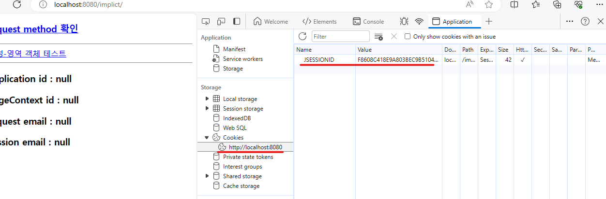

## JSP 웹 프로그래밍

### JSP 개요

- 인터넷과 웹
    - 인터넷 : TCP/IP 통신 프로토콜을 통해 정보를 주고받는 전세계 컴퓨터 네트워크
    - 웹 : world wide web의 줄임말
    - 웹은 기본적으로 서버/클라이언트 방식으로 동작
    - 가장 널리 쓰이는 웹 서버 : Apache, Tomcat, IIS(Internet Information Server)
        - Apache : 정적인 화면만 보여줄 수 있음 (자바같은 프로그래밍 언어를 처리 불가능) - WEB
        - Tomcat : 동적인 화면도 보여줄 수 있음 (자바같은 언어를 통해 사용자가 보낸 데이터 처리 가능) - WAS (아파치 재단 소유) cf. 현재는 웹 역할도 함
        - IIS : window 기반 C 언어를 처리할 수 있는 웹 서버

    - 정적 웹 페이지 : 컴퓨터에 저장된 텍스트 파일을 그대로 보는 것
    - 동적 웹 페이지 : 저장된 내용을 다른 변수로 가공 처리하여 보는 것
        - PHP(Personal Home Page) : C 기반 대용량 처리 힘듬, ASP(Active Server Page) : C# 기반 윈도우에서만 처리, JSP(Java Server Page) : Java 기반

- 웹 실행 흐름
    - JSP : HTML 문서 상에서 Java를 다룰 수 있게 하는 것
    - 서블릿 : 클라이언트에서 요청한 웹 페이지 이벤트를 검출하는 것

- 설치 과정
```
1. JDK 설치 후 시스템 환경변수 설정
2. tomcat 10.1.x zip 파일 설치 (https://tomcat.apache.org/download-10.cgi), 압축풀기
3. bin 폴더 안의 startup.bat, shutdown.bat (windows 배치 파일) 실행 테스트
4. localhost:8080 접속 테스트 (오류가 발생한다면, 압축푼 폴더 위치가 실행 권한이 없을 시 발생)

5. eclipse Eclipse IDE for Enterprise Java and Web Developers (JSP) (https://www.eclipse.org/downloads/packages/)
   but spring을 사용할 것이기에 
(https://spring.io/tools/) Spring Tools 4 for Eclipse Windows 용 설치 후 실행
6. SpringToolSuite4.ini (eclipse 설정) 열어서 java version 확인 (저는 17)
7. SpringToolSuite4.exe 실행 후 eclipse 경로 설정 후, 실행
8. eclipse marketplace > web > Eclipse Enterprise Java and Web Developer Tools 설치
9. windows preferences 클릭 후, Trust all
10. windows preferences 클릭 후, encodeing > css,html,jsp Files Encoding(UTF-8)
11. file > new > other > server > server > next > apache > tomcat v10.1 > next > apache-tomcat-v10.1.x 설치한 폴더로 경로 설정 후, finish (java 용 설정)
12. context.xml -> 설정, server.xml -> 서버 설정 (포트나 requset encoding 설정 가능, welcome-file-list 설정 가능)
13. file > new other > Web > Dynamic web project > project 이름 설정 > generate web.xml 설정 (web 용 설정)
```

- 테스트 진행 과정
```
1. 설치한 폴더 apache-tomcat-10.1.x 안의 bin 폴더가 실행 파일
2. WebApps 폴더 안의 ROOT 디렉토리가 main (디렉토리 구분자 필요 없음)
3. WebApps 안의 second 폴더를 생성하고 index.html 을 생성하면, localhost:8080/second 로 접속 가능
```

- Headers 설명
```
Request URL : 요청 경로
Request Method : GET(주소표시창에 표시), POST(주소표시창에 표시 x)
Status Code : 200(성공), 404(실패)
Remote Address : [::1]:8080 = localhost:8080

Connection : 연결 상태 (keep-alive)
Content-length : 길이
Content-Type : ex. text/html (대분류/확장자)
```

### 스크립트 태그 (JSP)

- 스크립트 태그의 종류
    - <% ... %>를 사용
    - 선언문 declaration <%! ... %> -> 자바 변수나 메소드를 정의하는 데 사용
    - 스크립틀릿 scriptlet <% ... %> -> 자바 로직 코드를 작성하는 데 사용
    - 표현문 expression <%= ... %> -> 변수, 계산식, 메소드 호출 결과를 문자열 형태로 출력하는 데 사용

### 디렉티브 태그 (JSP)

- 디렉티브 태그의 종류
    - page <%@ page ... %> -> JSP 페이지에 대한 정보 설정
    - include <%@ include ... %> -> JSP 페이지의 특정 영역에 다른 문서를 포함
    - taglib <%@ taglib ... %> -> JSP 페이지에서 사용할 태그 라이브러리를 설정


### <a href=./04_error_page>error 관리</a>

### 내장 객체
- JSP 페이지에서 사용할 수 있도록 JSP 컨테이너에 미리 정의된 객체

- 속성 처리 메서드 종류 (하나의 객체임)
    - session, application, request, pageContext

- Session(Cookie)
    - JSESSIONID라는 정보로 쿠키 정보가 없으면 새로 생성하고 구분할 수 있는 ID를 부여함
        - 먼저 서버에 있는 session 객체가 브라우저가 접속하면 JSESSIONID가 존재하는지 확인하고, 존재하지 않는다면 새로운 객체를 생성해서, Value값을 할당해줌
        - 만약 존재한다면, 같은 value값을 가지고 있는지 확인해서 브라우저 정보를 검사
        - Expire이 Session이면 브라우저 종료되면 삭제된다는 의미



배포서술자 = web.xml (deploy describer)


### 페이징 처리
1. 게시물 페이징 처리
    - 사용자가 넘겨주는 데이터 : page(어느 페이지), perPageNum(페이지당 보여줄 게시물 개수)
```
만약 사용자가 page 를 1을 보내주면,
1 - 1 * 5 = 0  [ (page -1) * perPageNum = startRow ]
startRow(sql 쿼리에서 설정할 시작 인덱스)

SELECT * FROM {테이블} ORDER BY DESC limit ?, ?;에서
앞의 ?는 시작 인덱스 (0부터 시작), 뒤의 ?는 몇개를 가져올건지

2 - 1 * 5 = 5 {<- 2페이지를 보낸다면}
```

- 구할 수 있는 데이터 : 즉 정리하자면, page, perPageNum, startRow를 알 수 있으면 게시물 페이징 처리가 가능하다.

2. 페이지 페이징 처리
    - 사용자가 넘겨주는 데이터 : page(어느 페이지), perPageNum(페이지당 보여줄 게시물 개수) displayPageNum(페이지당 보여줄 페이지 개수), 전체 게시물 개수(SELECT count(*) FROM {테이블};)
```
구해야 할 것은
startPage(사용자가 보내준 페이지에서의 시작 페이지)
Math.ceil(page/(double)perPageNum) * perPageNum; -> 나중에 생각
endPage(사용자가 보내준 페이지에서의 마지막 페이지)
Math.ceil(page/(double)perPageNum) * perPageNum; -> ceil(1 / 5.0) * 5 = 5 (마지막 페이지)
maxPage(전체 페이지의 최대값)

prev (이전으로 갈 수 있는가 boolean)
first (가장 처음으로 갈 수 있는가 boolean)
last (가장 마지막으로 갈 수 있는가 boolean)
next (다음으로 갈 수 있는가 boolean)

```
- 구할 수 있는 데이터 : 정리하자면, page, perPageNum, totalCount 만 알 수 있으면 페이지 페이징 처리가 가능하다.